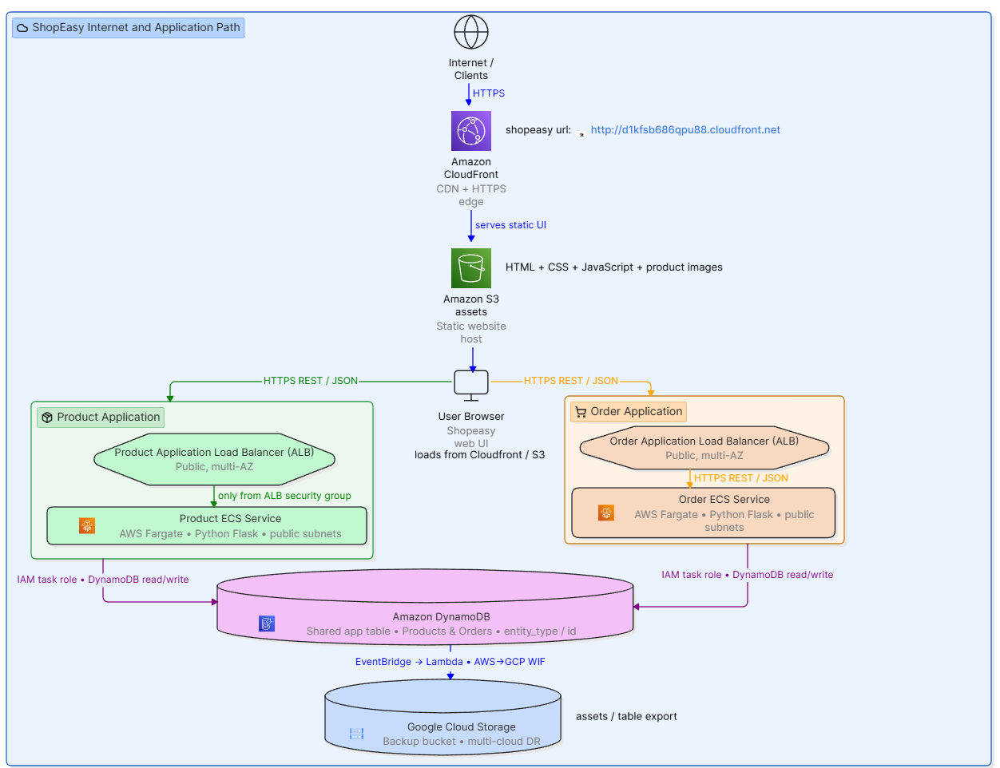
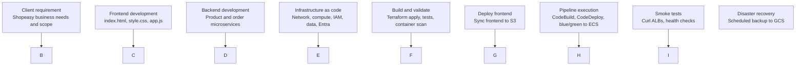
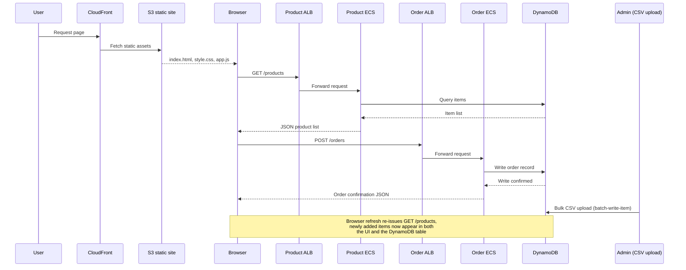
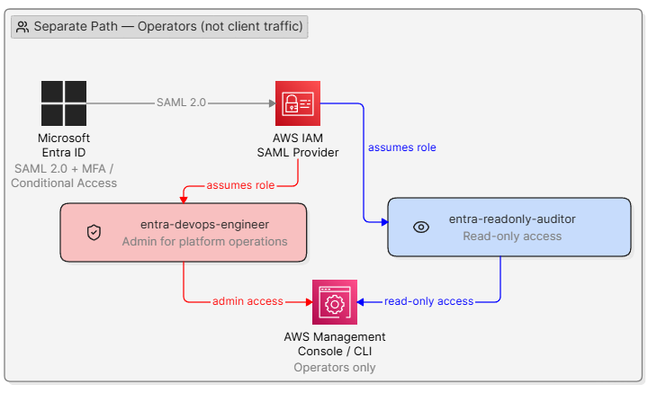

# Shopeasy — Multi-Cloud Containerized DevOps Platform

A production-style e-commerce platform built to demonstrate end-to-end enterprise Infrastructure as Code with Terraform, containerized microservices, automated CI/CD, and multi-cloud identity and disaster recovery — across **AWS**, **Microsoft Entra ID (Azure AD)** and **Google Cloud Platform**.

This project was built as a capstone in cloud engineering, structured the way a real platform team would build and document it: infrastructure as code using terraform comes first and automation comes second.

\---

## Table of contents

1. [Overview](#overview)
2. [Why this architecture](#Why this architecture)
3. [Architecture diagram](#Architecture diagram)
4. [Delivery lifecycle](#delivery-lifecycle)
5. [Tech stack](#tech-stack)
6. [Repository structure](#repository-structure)
7. [Prerequisites](#prerequisites)
8. [Setup and deployment](#setup-and-deployment)
9. [CI/CD pipeline](#cicd-pipeline)
10. [Monitoring and alerting](#monitoring-and-alerting)
11. [Identity federation (Microsoft EntraID)](#identity-federation-microsoft-entraid)
12. [Disaster recovery with GCP-backup](#disaster-recovery)
13. [Testing and validation](#testing-and-validation)
14.  [Deployment guide](#Deployment guide)
15. [Author](#author)

\---

## Overview

**ShopEasy** is a fictional e-commerce company running two core microservices — a **Product** and an **Order** services — Python/Flask deployed as containers on AWS ECS Fargate, fronted by CloudFront from a hosted S3 static storefront (index.html, app.js, sytle.css) and two Application Load Balancers, with data in DynamoDB. **A fully automated CI/CD pipeline** — push to GitHub, and CodePipeline builds both services *and* the frontend in parallel, then deploys all
  three: the two backend services via CodeDeploy blue/green (zero downtime), the frontend via a direct S3 sync. **Identity Federation**- Devops and Auditors federated in from **Microsoft Entra ID (Azure AD)** via SSO provider into the AWS Console instead of separate AWS-only user accounts, and DynamoDB data is backed up on a 24 hours schedule to **Google Cloud Storage** as cross-cloud backup for disaster recovery. The app-assets S3 bucket mirrors to Gogle Cloud Strorage.

Everything — networking, compute, security, monitoring and CI/CD is provisioned by **Terraform**, with state stored remotely in S3 with DynamoDB locking. Nothing is clicked together by hand in the AWS Console except two AWS unavoidable one-time
authorization steps deliberately does not allow to be automated (GitHub OAuth authorization, SAML certificate download and SNS subscription confirmation).

**Why a fictional company?** Real production READMEs read like this one: a clear business context, a diagram a can be understand in ten seconds, and infrastructure that's reproducible from a single `git clone`. This project is built to that standard.

\---

## Why this architecture

A few decisions worth calling out, because being able to explain *why*, not just *what*, is what separates a portfolio project from a resume line:

* **Two ALBs instead of one shared ALB** — keeps the two microservices independently scalable and independently deployable. A bad deploy to Order Service can't take down Product Service's listener rules.
* **Public subnets, no NAT gateway** — ECS tasks need outbound access to pull images from ECR and write logs to CloudWatch. Rather than pay for a NAT gateway, tasks run in public subnets with tightly scoped security groups (ingress only from the ALB security group). This is a deliberate cost/security trade-off, documented so it can be defended, not an oversight.
* **DynamoDB over RDS** — the application's access pattern (product lookups, order writes) is key-value shaped, and DynamoDB removes the operational overhead of patching and scaling a relational engine for a project at this scale.
* **Blue/green deployments via CodeDeploy** — zero-downtime releases, and a fast rollback path if a new task definition fails health checks.
* **Identity federation instead of IAM users** — engineers sign in through Microsoft EntraID via SAML, with Entra groups mapped to IAM roles (`DevOpsEngineer`, `ReadOnlyAuditor`). No long-lived IAM user credentials.
* **Google Cloud Storage for backups, not a second AWS region** — this project treats disaster recovery as a genuinely separate failure domain (a different cloud provider entirely), and it's a deliberate way to demonstrate multi-cloud proficiency rather than just multi-AZ.

\---

## Architecture diagram


**Read this diagram top to bottom:** a client request hits CloudFront, which routes into the VPC to one of two ALBs, each fronting its own ECS Fargate service, both sharing a DynamoDB table. Microsoft EntraID federates operator identity into the account separately from the client traffic path. DynamoDB is exported to Google Cloud Storage on a schedule for disaster recovery.

<p align="center">

</p>

## Delivery lifecycle



|Stage|Files|
|-|-|
|Client requirement|—|
|Frontend development|`index.html`, `style.css`, `app.js`, `buildspec.yml`|
|Backend development|`app.py`, `Dockerfile`, `requirements.txt`, `taskdef.json`, `appspec.yml`, `test\_app.py`, `buildspec-product.yml` (product service), `buildspec-order.yml` (order service)|
|Infrastructure as code|Base config: `.gitignore`, `locals.tf`, `backend.tf`, `data.tf`, `terraform.tfvars`, `variables.tf`, `outputs.tf`, `providers.tf` · Edge network: `cloudfront.tf` · Foundation \& networking: `vpc.tf`, `security\_groups.tf` · Compute: `ecs.tf`, `alb.tf`, `ecr.tf` · Security \& IAM: `iam.tf`, `identity\_federation.tf` · Data layer: `s3.tf`, `dynamodb.tf` · Monitoring: `autoscaling.tf`, `sns.tf`|
|Build and validate|`build-all.sh`, `terraform-validate.sh`, `unit-tests.sh`, `container-build-scan.sh`|
|Deploy frontend|`deploy-frontend.sh`|
|Pipeline execution|`codepipeline.tf`, `codebuild.tf`, `codedeploy.tf`|
|Smoke tests|`smoke-tests.sh`|
|Disaster recovery|`gcp\_backup.tf`, `backup-to-gcp.sh`|

A note on sequencing, since it's easy to get wrong: **Terraform only runs once**, in the "Build and validate" stage — that single `terraform apply` provisions everything from the VPC through `identity\_federation.tf`. It does not run again after the CI/CD pipeline deploys the application; by that point the infrastructure already exists, and CodeDeploy is only shifting traffic between task sets, not creating resources. Identity federation is also folded into infrastructure-as-code rather than treated as a late step, because `identity\_federation.tf` is applied in the same run as `iam.tf` — the SAML trust exists before the application is ever deployed, not after.

Once all nine stages above complete, the application is deployed and live — which is where the next section picks up.

\---

## Runtime request and data flow

This is what happens after everything above is deployed — a live request hitting the running system, plus how new inventory gets added.



## Blue/green deployment (zero downtime)
<p align="center">

</p>

CodeDeploy stands up the new task set (green) alongside the running one (blue), health-checks it behind the same target group, and only shifts traffic once green is confirmed healthy. Blue is kept running for a configurable rollback window — if green starts failing post-cutover, CodeDeploy shifts traffic back to blue automatically. Nothing is torn down until that window closes, so a bad deploy never causes a customer-facing outage.


## Tech stack

|Layer|Technology|
|-|-|
|Infrastructure as Code|Terraform (modular, remote state)|
|Compute|AWS ECR ECS Fargate ALB Traget Groups|
|Networking|AWS VPC, Subnets, Internet Gateway, Route Tables, CloudFront, Security Groups|
|Security|IAM |
|Data|DynamoDB, S3|
|CI/CD|AWS CodePipeline, CodeBuild, CodeDeploy (blue/green)|
|Identity|Microsoft EntraID (SAML 2.0, MFA)|
|Disaster recovery|Google Cloud Storage|
|Monitoring|Auto-Scaling CloudWatch, SNS|
|Frontend|HTML, CSS, JavaScript|
|Backend|Python (Flask), Docker|

\---

## Repository structure

```
shopeasy-repo/
├── aws_backup_lambda/
│   ├── main.tf
│   ├── handler.py
│   ├── terraform.tfstate
│   └── terraform.tfvars
├── bootstrap/
│   ├── main.tf
├── documentation/
│   ├── repository-structure\_repository structure.png
│  └── system-architecture\_shopeasy delivery lifecycle.png
├── frontend/
│   ├── images/
│   │   ├── hero.jpg
│   │   ├── prod-001.jpg
│   │   ├── rod-003.jpg
│   │   ├── prod-003.jpg
│   │   ├── prod-004.jpg
│   │   ├── prod-005.jpg
│   │   ├── prod-006.jpg
│   │   ├── prod-007.jpg
│   ├── buildspec.yml
│   ├── index.html
│   ├── style.css
│   └── app.js
├── gcp_backup/
│   ├── main.tf
│   ├── outputs.tf
│   └── variables.tf
│   └── terraform.tfvars
├── scripts/
│   ├── backup-to-gcp.sh
│   ├── cleanup.sh
│   ├── deploy-frontend.sh
├── services/
│   ├── product/
│   │   ├── tests/
│   │   │   ├──test_app.py
│   │   ├── app.py
│   │   ├── appspec.yaml
│   │   ├── Dockerfile
│   │   ├── requirements.txt
│   │   ├── taskdef.json
│   ├── order/
│   │   ├── tests/
│   │   │   ├──test_app.py
│   │   ├── app.py
│   │   ├── appspec.yaml
│   │   ├── Dockerfile
│   │   ├── requirements.txt
│   │   ├── taskdef.json
├── .gitignore
├── alb.tf
├── autoscaling.tf
├── backend.tf
├── buildspec-order.tf
├── buildspec-product.tf
├── cloudfront.tf
├── codedebuild.tf
├── codedeploy.tf
├── codepipeline.tf
├── data.tf
├── dynamodb.tf
├── ecr.tf
├── ecs.tf
├── entra-id-metadata.xml
├── iam.tf
├── identity_federation.tf
├── locals.tf
├── outputs.tf
├── providers.tf
├── s3.tf
├── security_groups.tf
├── sns.tf
├── terraform.tfvars
├── variables.tf
├── vpc.tf
└── README.md

```

\---

## Prerequisites

* Terraform >= 1.10.0
* AWS CLI v2, configured with credentials that can create IAM roles
* Docker
* An Azure tenant with permission to register an Enterprise Application (for SAML federation)
* A GCP project with a Cloud Storage bucket and a service account key for backup export
* An S3 bucket and DynamoDB table pre-created for Terraform remote state (see below)

\---

## Setup and deployment

### 1\. Configure the remote state backend

Terraform state starts locally on your machine and is then pointed at a remote backend for team use and state locking:

```bash
aws s3 mb s3://shopeasy-terraform-state --region us-east-1
aws dynamodb create-table \\
  --table-name shopeasy-terraform-lock \\
  --attribute-definitions AttributeName=LockID,AttributeType=S \\
  --key-schema AttributeName=LockID,KeyType=HASH \\
  --billing-mode PAY\_PER\_REQUEST
```

`terraform/backend.tf` then points at this bucket and table.

### 2\. Provision the infrastructure

```bash
cd terraform
terraform fmt
terraform init
terraform validate
terraform plan 
terraform apply 
```

This creates, in order: the VPC and networking, security groups, ALBs, ECR repositories, ECS cluster and services, IAM roles, autoscaling policies and CloudWatch alarms, S3 buckets, the DynamoDB table, and the CloudFront distribution.

### 3\. Build and validate locally

```bash
./scripts/build-all.sh


### 4\. Let the pipeline take over

Once infrastructure exists, pushing to the tracked branch triggers CodePipeline, which builds both service images, pushes them to ECR, and performs a blue/green deployment via CodeDeploy to ECS.

### 5\. Deploy the frontend

```bash
./scripts/deploy-frontend.sh
```

Syncs `frontend/` to the S3 origin bucket and invalidates the CloudFront cache.

### 6\. Verify

```bash
./scripts/smoke-tests.sh
```

Curls both ALBs and confirms ECS service health before calling the deployment successful.

\---

## CI/CD pipeline

```
GitHub  →  CodePipeline  →  ┌─ CodeBuild (product) ─┐  →  ECR  →  ┌─ CodeDeploy (product) ─┐  →  ECS
                             └─ CodeBuild (order)   ─┘             └─ CodeDeploy (order)   ─┘
```

Both services build and deploy in parallel. CodeDeploy performs a **blue/green** shift — a new task set is stood up, health-checked behind the ALB target group, and traffic is cut over only once it's healthy. A failed health check halts the shift and the old task set keeps serving traffic, so a bad deploy never causes downtime.

\---

## Identity federation (Microsoft EntraID)

Engineers and operators never receive long-lived AWS IAM user credentials. Instead:

1. An Enterprise Application is registered in Microsoft EntraID with SAML 2.0 SSO for AWS.
2. `identity\_federation.tf` creates an `aws\_iam\_saml\_provider` using the Entra metadata, plus IAM roles that trust that provider.
3. Entra groups are mapped to IAM roles — for example, `DevOpsEngineer` maps to an IAM role with ECS and Terraform-relevant permissions, and `ReadOnlyAuditor` maps to a read-only role.
4. MFA and conditional access are enforced at the Entra ID layer.
5. Signing in to the AWS Console happens via the Entra ID SSO portal, not an IAM login page.



\---

## Monitoring and alerting

* **CloudWatch Logs** capture container stdout/stderr from both ECS services.
* **Four CloudWatch alarms** (high-CPU and low-CPU per service) drive **four autoscaling policies** (scale-out and scale-in per service).
* An **SNS topic** notifies on failed deployments and scaling events, so a bad release surfaces immediately instead of silently degrading.

\---

## Disaster recovery

DynamoDB data is exported on a schedule and pushed to a Google Cloud Storage bucket in a separate cloud provider — a deliberate choice to guard against an AWS-wide outage, not just a single-AZ failure:

```bash
./scripts/backup-to-gcp.sh
```

Restoration is validated by pulling the latest export back down and comparing record counts against the live DynamoDB table.

\---

## Testing and validation

|Check|Tool|What it catches|
|-|-|-|
|Terraform syntax and plan|`terraform validate`, `terraform plan`|Misconfigured resources before they're ever applied|`terraform validate`,|Application unit tests|`test\_app.py` via `unit-tests.sh`|Broken business logic in Product/Order services||Container image scanning|`container-build-scan.sh`|Known CVEs in base images and dependencies|
|Post-deploy smoke tests|`smoke-tests.sh`|ALB reachability and ECS task health after every deploy|

\---

## Deployment guide

This is a condensed reference - the full step-by-step walkthrough with
explanations lives in the documentation `README.md`. This file is the
quick-reference version for once you already know the project.

## First-time setup

```bash
cd bootstrap && terraform init && terraform apply && cd ..
az login
gcloud auth application-default login
aws configure
cp terraform.tfvars.example terraform.tfvars   # fill in real values
terraform init
terraform plan
terraform apply
```

## Push first images manually (services need at least one image to start)

```bash
./scripts/build-all.sh    # test + build locally first
aws ecr get-login-password --region us-east-1 | docker login --username AWS --password-stdin <account-id>.dkr.ecr.us-east-1.amazonaws.com
docker push $(terraform output -raw product_ecr_repo_url):latest
docker push $(terraform output -raw order_ecr_repo_url):latest
```

## Authorize the GitHub connection (one-time, manual, unavoidable)

AWS Console > Developer Tools > Connections > find the pending connection >
**Update pending connection**.

## Every deploy after that

```bash
git add .
git commit -m "your change"
git push
```
CodePipeline picks it up automatically: tests run, images build, both
backend services deploy via CodeDeploy blue/green, the frontend deploys to
S3 - all from one push.

## Rollback

CodeDeploy auto-rolls-back on failed health checks or triggered alarms
(see `blue-green.md`). Manual rollback: AWS Console > CodeDeploy >
Applications > [product or order] > the failed deployment > **Stop and
roll back**.

## Tear down

```bash
./scripts/cleanup.sh
```


## Author

Built as a cloud engineering capstone project demonstrating multi-cloud Infrastructure as Code (IaC) via Terraform, containerized microservices, automated CI/CD, cross-cloud identity federation AWS SSO with Microsoft Entra ID (Azure AD) and robust disaster recovery across providers AWS to GCP for AWS S3 bucket Frontend assets bucket for the WebApp. Every architectural choice is documented to justify tool selection, risk management and cost optimization and multi-cloud trade-offs

# Federation

Federation allows external identity providers to authenticate users into cloud platforms without creating local cloud accounts.

ShopEasy uses:

Azure Entra ID:
Human authentication

AWS IAM:
Authorization

AWS uses SAML SSO federation.

Applications use service accounts for machine authentication.

